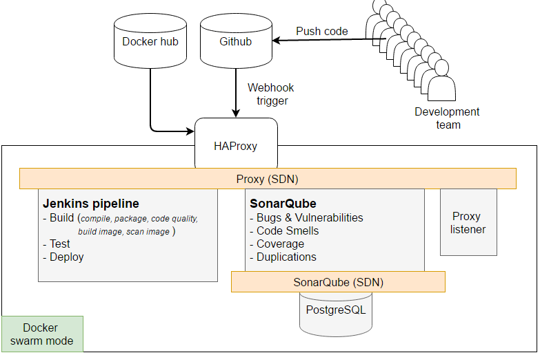

**User story**
* As a member of DevOps team I want to deploy DevOps tools in swarm mode so that project can run Coninious Integration
*  As a member of DevOps team I want to send Jenkins build logs to Elastic stack via [filebeat](https://www.elastic.co/guide/en/beats/filebeat/current/filebeat-overview.html) so that Ops team can diagnose issues by analysing all available logs in a central logging system.
* As a member of build team I want to run Jenkins Blue Ocean pipelines that checks code quality _(SonarQube)_, archive build artifacts _(Nexus)_ and runs docker image security scanning _(Anchore)_

**Prerequisite**
* Set up a development infrastructre by following [Infra as Code](https://github.com/shazChaudhry/infra) repo on github
* Setup Elastic Stack by following [this](https://github.com/shazChaudhry/logging) github repo

**Instructions:**
* Log into the master node in the Docker Swarm cluster setup above
* Clone this repository and change directory to where repo is cloned to
* Deploy stack by run the following command:
  * `docker stack deploy -c docker-compose.yml ci`
* Check status of the stack services by running the following command:
  *   `docker stack services ci`
* In your favorite web browser navigate to <a href="http://node1:9080/">http://node1:9080/</a>. This Visualizer will show all services running in the swarm mode.
* Once all services are up and running, proceed to testing

**Test:**
* <a href="http://node1:5601">http://node1:5601</a> (Kibana). Username: `elastic`; Password: `changeme`. On the Management tab, add two indexes; `logstash-*` and `filebeat-*`
  * On the Kibana Discover tab, select `logstash-*` index to view logs sent by DevOps tools
* <a href="http://node1/jenkins"/>http://node1/jenkins</a> _(Jenkins)_. Follow the setup wizard to initialize Jenkins
* <a href="http://node1/sonar"/>http://node1/sonar</a> _(SonarQube)_. Username: admin; Password: admin
* <a href="http://node1/nexus"/>http://node1/nexus</a> _(Nexus)_. Username: admin; Password: admin123

**Test pipeline**
* Fork a [simple java project](https://github.com/shazChaudhry/java.git). This project will be used to check code quality and run security scanning on the image generated
* In Jenkins' pipeline editor, creat a new pipeline job by pointing it to the simple java project just forked
* While the simple java project is being executed, visit Kibana Discover tab and select `filebeat-*` index to view Jenkins build logs

**Clean-up:**
* On the swarm master node, run the following commands to remove swarm services:
  * `docker stack rm ci`
  * `docker stack rm logging`
*	To tear down the infrastructure, exit swarm master node and then run `vagrant destroy`
